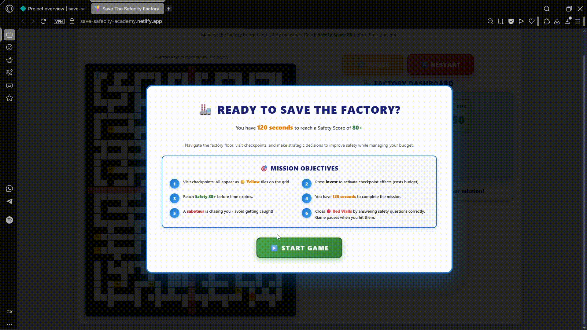

# OSH Budget Quest – Save the SafeCity Factory

A fast-paced React + Phaser mini-game where you manage safety investments and budget on a factory floor. Reach a Safety Score of 80+ before the timer runs out while avoiding a chasing enemy and navigating quiz-gated math walls.

Live gameplay logic is driven by React state; Phaser renders the grid, player, checkpoints, math walls, and the enemy for smooth visuals. Web Audio API powers simple sound effects.

## Features

- Strategic gameplay: Invest at checkpoints (`G`, `R`, `Y`) to modify Budget, Safety, and Risk
- Quiz-gated math walls: Unlock passages by answering OSH questions correctly
- Enemy chase: A* pathfinding saboteur hunts the player
- Easter eggs: Temporary bonuses and surprises scattered on the map
- Clean architecture: React owns logic; Phaser is a view layer
- Modern stack: Vite, React, Phaser 3, ESLint, Web Audio API

## Tech Stack

- React (with Fast Refresh) via Vite
- Phaser 3 for rendering and animations
- ESLint (React hooks + refresh plugins)
- Web Audio API for SFX

## Gameplay



## Project Structure

```
src/
	App.jsx                 # Main game logic and UI
	components/             # Dashboard, GridRenderer, StatCard
	data/gameData.js        # Map, checkpoints, quizzes, easter eggs
	hooks/useSoundManager.js# Web Audio API-based SFX manager
	phaser/PhaserLayer.jsx  # Phaser scene rendering + enemy AI
	utils/gameUtils.js      # Movement rules, tile helpers, quizzes
```

Key files to explore:
- App: Main gameplay loop, input handling, timers, messages
- PhaserLayer: Grid drawing, player tweening, enemy A* chase, game-over handling
- gameData: Factory map, objectives, quiz definitions, easter eggs
- gameUtils: Movement validation, math wall logic, quiz lookup
- useSoundManager: Start/stop background loop, win/lose/feedback SFX

## Getting Started

Requirements: Node.js 18+ and npm.

Install dependencies and start dev server:

```bash
npm install
npm run dev
```

Build for production and preview locally:

```bash
npm run build
npm run preview
```

Common scripts:

- `npm run dev`: Start Vite dev server
- `npm run build`: Production build
- `npm run preview`: Preview built assets
- `npm run lint`: Run ESLint

## Gameplay Overview

- Move with arrow keys. Reach checkpoints labeled `G1…G6`, `R1…R5`, `Y1…Y5` to make decisions.
- Press Invest/Skip in the UI to apply or ignore a checkpoint’s effects.
- Math walls form a horizontal barrier (row 18) and a vertical barrier (column 15). Answer the OSH safety question correctly to unlock a gate and pass.
- A saboteur enemy pursues you using A* pathfinding. Colliding triggers game over.
- Easter eggs blink into view periodically and can freeze the enemy, freeze the player, trigger instant win, or open a surprise.
- Win by reaching Safety Score ≥ 80 before time expires. Lose if budget runs out, safety hits 0, risk > 80, wrong quiz answer, or the enemy catches you.

## How It Works (Architecture)

- React drives all state: budget, safety, risk, timers, player position, gate unlocks, messages.
- PhaserLayer reads state and renders a grid scene: tiles, player tweening to the current tile, enemy path recalculation, and on-screen labels.
- Communication is one-way from React to Phaser via props; events like game over call a callback to update React state.

## Tutorial: Customize and Extend

This guide shows how to add new checkpoints, quizzes, easter eggs, and adjust the map.

### 1) Add a new checkpoint

1. Open [src/data/gameData.js](src/data/gameData.js).
2. In `objectives`, add a new entry, e.g. `G7` with `name`, `description`, `cost`, and stat changes:

```js
G7: { id: 'G7', type: 'advantage', name: '🧯 Fire Safety', description: 'Install extinguishers and training', cost: 1200, safetyChange: +5, accidentRiskChange: -3, budgetChange: 0, timeChange: 0 }
```

3. Place `G7` on the map by editing `factoryMap` to swap a `F` tile to `G7` at your desired coordinates.
4. Run the game; when you step on the `G7` tile, the UI lets you Invest or Skip.

Tips:
- Use `type: 'advantage' | 'disadvantage' | 'neutral'` to control sound feedback and balancing.
- Keep costs and stat changes consistent to maintain difficulty.

### 2) Add or adjust math wall quizzes

1. In [src/data/gameData.js](src/data/gameData.js), each gate has an ID (e.g. `gate-h1`, `gate-v3`).
2. Edit `MATH_WALL_QUIZZES[gateId]` to change `objective`, `question`, `options`, and `correctIndex`.
3. During play, when you attempt to cross a math wall, you’ll get a prompt; correct answers unlock that cell.

### 3) Add an Easter egg

1. In [src/data/gameData.js](src/data/gameData.js), append a new object to `EASTER_EGGS`:

```js
{ x: 12, y: 16, id: 'egg-speed', type: 'stop-enemy', name: '🚀 Speed Boost', description: 'Example bonus' }
```

2. Supported `type` values in the current logic:
	 - `stop-enemy`: Freeze enemy for 15s
	 - `instant-win`: Immediate victory
	 - `freeze-player`: Freeze player for 10s
	 - `rick-roll`: Opens a surprise link

3. The map will periodically blink visible eggs; colliding with the egg applies the effect.

### 4) Change map size or layout

1. Update `MAP_WIDTH`, `MAP_HEIGHT` in [src/data/gameData.js](src/data/gameData.js).
2. Ensure `factoryMap` has `MAP_HEIGHT` rows and each row has `MAP_WIDTH` columns.
3. Tiles:
	 - `W` = wall
	 - `F` = floor
	 - `G#` = advantage checkpoint
	 - `R#` = disadvantage checkpoint
	 - `Y#` = neutral checkpoint
4. Math walls auto-mark the barrier at row 18 and column 15. Update `MATH_WALL_CELLS` and `MATH_WALL_GATES` if you customize barrier positions.

### 5) Customize sounds

- See [src/hooks/useSoundManager.js](src/hooks/useSoundManager.js):
	- `startBackgroundSound()` starts a simple chiptune loop.
	- `playGoodInvestSound()`, `playBadInvestSound()`, `playNeutralInvestSound()` provide quick feedback.
	- `playWinSound()` and `playLoseSound()` mark end states.
- You can replace oscillator-based SFX with sampled audio if desired.

### 6) Phaser integration notes

- `PhaserLayer` consumes `map`, `playerPosition`, `solvedMathWalls`, and flags like `gameStarted`, `isPaused`.
- The enemy recalculates path every ~500ms and moves at a reduced speed for fairness.
- Player movement is tweened to improve feel; collision checks run in the scene.

## Deployment

You can deploy the built `dist/` folder to any static host:

- GitHub Pages: Push `dist/` to a `gh-pages` branch or use an Action
- Vercel/Netlify: Import the repo, set build command to `npm run build` and output to `dist`

## Contributing

PRs are welcome! Keep changes scoped and consistent with the existing style. Use ESLint locally (`npm run lint`).

## License

Proprietary or choose a license. If open-sourcing, consider MIT.
